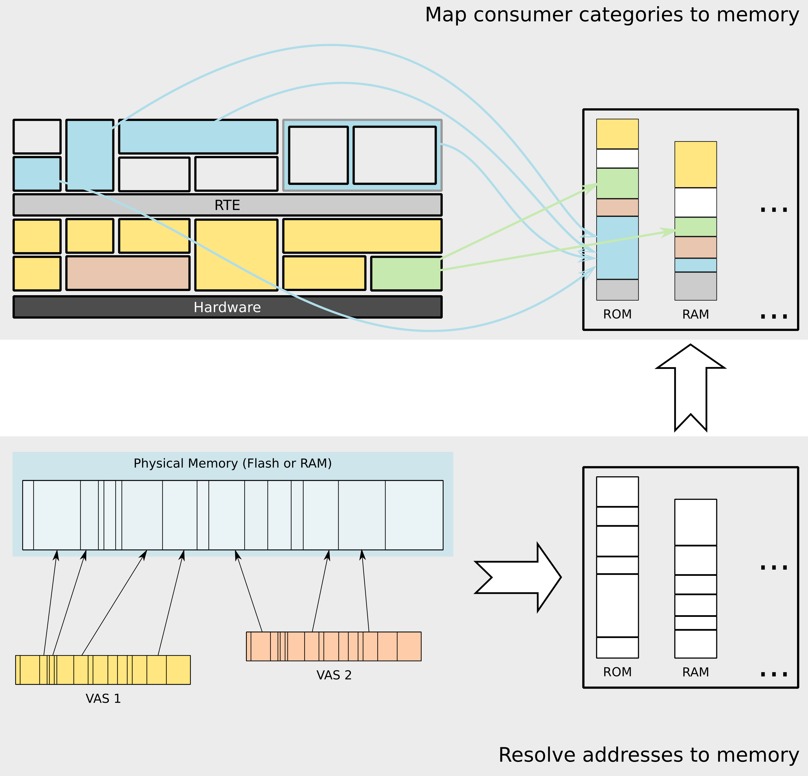
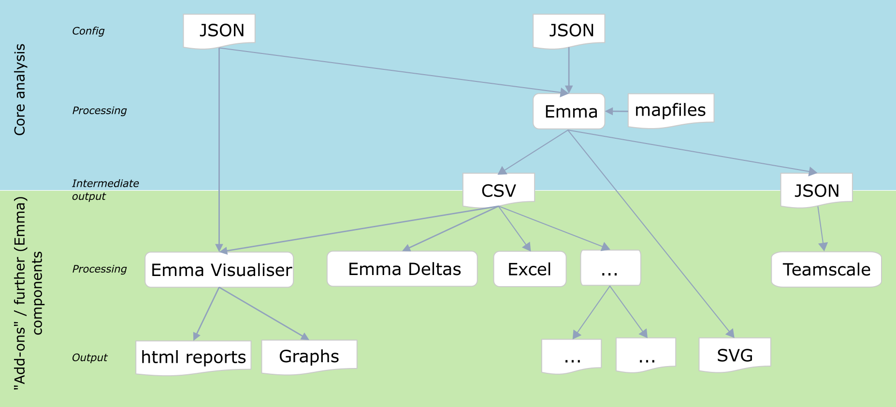

# Emma

[](https://www.codacy.com/app/holzkohlengrill/Emma?utm_source=github.com&amp;utm_medium=referral&amp;utm_content=bmwcarit/Emma&amp;utm_campaign=Badge_Grade)
[](https://www.codacy.com/app/holzkohlengrill/Emma?utm_source=github.com&utm_medium=referral&utm_content=bmwcarit/Emma&utm_campaign=Badge_Coverage)
[](https://travis-ci.org/bmwcarit/Emma)
[](https://pypi.org/project/pypiemma/)
[](https://www.gnu.org/licenses/gpl-3.0)
[](https://bmwcarit.github.io/Emma)

**Emma Memory and Mapfile Analyser (Emma)**

> Conduct static (i.e. worst case) memory consumption analyses based on arbitrary linker map files. It produces extensive `.csv` files which are easy to filter and post-process. Optionally `.html` and markdown reports as well as neat figures help you visualising your results.

<!-- We use onerror to make images visible when viewing the content using GitHub Pages etc. on the other side reading the markdown file using an editor should kept intact -->
<div align="center">  </div>

Given a **map file input** (Green Hills map files are the default but others - like GCC - are supported via configuration options; examples are enclosed) Emma **map**s the addresses of sections (aka images) and/or objects (aka modules) **to memory regions** (all addresses given via map files must be known during compile time). Those memory regions are classified into two levels of granularity respectively. The first level defines arbitrary groups based on your personal taste (however using names similar to those defined by your microcontroller vendor makes most sense). Later each of those regions (second level) are assigned to one of four generalised predefined memory regions (those are: `INT_RAM`, `INT_FLASH`, `EXT_RAM`, `EXT_FLASH`). In case of **virtual memory** objects and sections lying within virtual address spaces (VASes) get **translated back into physical memory**. This is depicted in the figure above (lower part).

**Categorisation** can be used to assign consumers (a consumer would usually represent a software component) to each object or section. This is useful for subsequent steps in order to display memory consumption per consumer type. See the upper part of the figure shown above. Mechanisms are provided to batch categorise object and section names. "Objects in sections" provides ways to obtain a **finer granularity of the categorisation result**. Therefore categorised sections containing (smaller) objects of a different category got split up and result into a more accurate categorisation.

As a result you will get **output** files in form of a **`.csv` file** which sets you up to do later processing on this data easily. In this file **additional information is added** like:

* Overlaps (of sections/objects)
* Containments (e.g. sections containing objects)
* Duplicates
* All meta data about the origin of each section/object (mapfile, addess space, ...)
* ...

Holding the aforementioned **augmented data** makes it easy to **detect issues in linker scripts** and get an **in-depth understanding of** your program's **memory consumption**. Including a lot of additional and "corrected" data can cause confusion. Thus all original (unmodified) data is preserved in the output files simultaneously.

The Emma visualiser helps you to create nice plots and reports in a `.png` and `.html` and markdown file format.

The whole Emma tool suite contains command line options making it convenient to be **run on a build server** like `--Werror` (treat all warnings as errors) or `--no-prompt` (exit and fail on user prompts; user prompts can happen when ambiguous configurations appear such as multiple matches for one configured map files).

------------------------
<!-- We use onerror to make images visible when viewing the content using GitHub Pages etc. on the other side reading the markdown file using an editor should kept intact -->
<div align="center">  </div>


## Installation

```bash
pip3 install pypiemma
```

Dependencies: Python 3.6 or higher; `pip3 install Pygments Markdown matplotlib pandas pypiscout`


## General Workflow
The following figure shows a possible workflow using Emma:

<!-- We use onerror to make images visible when viewing the content using GitHub Pages etc. on the other side reading the markdown file using an editor should kept intact -->
<div align="center">  </div>

**Emma** - as the core component - produces an intermediate `.csv` file. Inputs are mapfiles and JSON files (for configuration (memory layout, sizes, ...)). From this point you are very flexible to choose your own pipeline. You could

* use the Emma tools (**Emma Visualiser**, **Emma Deltas**, ...) for **further processing (data aggregation and analysis)**,
* simply your favourite spreadsheet software (like Microsoft Excel or LibreOffice Calc) or
* use your own tool for the data analysis.


## Quick Start Guide
At this point we want to give you a brief overview what to do in the below two scenarios. If you want to play around go to [(project files are already present)](#Project-files-are-already-present) and use our example projects in `./doc/test_project*`.

* if the Emma *project is already set-up* (JSON files were created) and you want to analyse your software with newly generated mapfiles proceed to [-> Project files are already present](#Project-files-are-already-present) or
* you *start* your analysis *from scratch* and need to do configure Emma before you use it then go to [-> Project files have to be created](#project-files-that-have-to-be-created).

Example projects (including Emma* outputs/results) can be found in `./doc/test_project*`.

*Since version 3.1* Emma can be called in two ways (if you want to run it from the installation folder) where the following variant is recommended:

```bash
python Emma.py a --project doc/test_project --mapfiles doc/test_project/mapfiles --noprompt
```

The following table provides an overview how you call Emma:

| Emma module | Entry point + \<options\> (if installed via `pip`) | Top level sub-command (tlsc) (`python Emma.py` \<tlsc\>) | Module (`python -m` + \<module\> \<options\>) |
| ----------- | --------------------------------------------------- | -------------------------------------------------------- | --------------------------------------------- |
| Analyser    | `emma`                                              | `a`                                                      | `Emma.emma`                                   |
| Visualiser  | `emma_vis`                                          | `v`                                                      | `Emma.emma_vis`                               |
| Deltas      | `emma_deltas`                                       | `d`                                                      | `Emma.emma_deltas`                            |


------------------------


### Project files are already present
Try `python Emma.py a --help` to see all possible options or refer to the documentation (`./doc/*`).

1. Create intermediate `.csv` from mapfiles with Emma:

```bash
python Emma.py a -p .\MyProjectFolder --map .\MyProjectFolder\mapfiles --dir .\MyProjectFolder\analysis --subdir Analysis_1
```

2. Generate reports and graphs with Emma Visualiser:

```bash
python Emma.py v -p .\MyProjectFolder --dir .\MyProjectFolder\analysis --subdir Analysis_1 -q 
```

### Project files that have to be created
To create a new project, the following files must be created:

* `globalConfig.json`
* `budgets.json`
* `categories.json`
* `categoriesKeywords.json`
* `categoriesSections.json`
* `categoriesSectionsKeywords.json`

You will find example projects in `./doc/test_project*`. In-depth documentation can be found in the full documentation (see `./doc/`).

A basic configuration can be short per file. For complex systems you can choose from many optional keywords/options that will provide you means to adjust your analysis as fine grained as you wish.

One main concept includes the `globalConfig.json`. You can see this as meta-config. Each configuration ID (configID) is a separately conducted analysis. Per configID you state individually the configuration files you want to use for this exact analysis. Herewith you can mix and match any combination of subconfigs you prefer.

<!-- We use onerror to make images visible when viewing the content using GitHub Pages etc. on the other side reading the markdown file using an editor should kept intact -->
<div align="center">  </div>

A `globalConfig.json` could look like this:

```json
{
    "configID1": {
        "addressSpacesPath": "addressSpaces.json",
        "sectionsPath": "sections.json",
        "patternsPath": "patterns.json"
    }
}
```


## Full documentation
For the full documentation please refer to the `./doc/` directory.


## Contribute
We are glad if you want to participate. In `./doc/dev-guide.md` you will find a guide telling you everything you need to know including coding conventions and more.

## [Mailing List](https://groups.google.com/forum/#!forum/emma-dev)

```text
emma-dev (. at) googlegroups.com
```


## Dependencies & Licences

| Library (version)    | pip package name                                    | Licence                              | URL                                                                                                                                                                                          |
|----------------------|-----------------------------------------------------|--------------------------------------|----------------------------------------------------------------------------------------------------------------------------------------------------------------------------------------------|
| Markdown (v3.0.1+)   | [Markdown](https://pypi.org/project/Markdown/)      | BSD-3-Clause                         | [https://github.com/Python-Markdown/markdown](https://github.com/Python-Markdown/markdown); [https://python-markdown.github.io/](https://python-markdown.github.io/)                         |
| Pandas (v0.23.4+)    | [pandas](https://pypi.org/project/pandas/)          | BSD-3-Clause                         | [https://github.com/pandas-dev/pandas/](https://github.com/pandas-dev/pandas/); [http://pandas.pydata.org/getpandas.html](http://pandas.pydata.org/getpandas.html)                           |
| Pygments (v2.3.1+)   | [Pygments](https://pypi.org/project/Pygments/)      | BSD-2-Clause                         | [https://bitbucket.org/birkenfeld/pygments-main/src/default/](https://bitbucket.org/birkenfeld/pygments-main/src/default/); [http://pygments.org/download/](http://pygments.org/download/)   |
| Matplotlib (v3.0.0+) | [matplotlib](https://pypi.org/project/matplotlib/)  | Matplotlib License (BSD compatible)  | [https://matplotlib.org/users/installing.html](https://matplotlib.org/users/installing.html); [https://github.com/matplotlib/matplotlib](https://github.com/matplotlib/matplotlib)           |
| SCout (v1.8+)        | [pypiscout](https://pypi.org/project/pypiscout/)    | MIT                                  | [https://github.com/holzkohlengrill/SCout](https://github.com/holzkohlengrill/SCout)                                                                                                         |
| Graphviz (v0.11.1+)  | [graphviz](https://pypi.org/project/graphviz/)      | MIT                                  | [https://github.com/xflr6/graphviz](https://github.com/xflr6/graphviz)                                                                                                                       |


**Dependencies needed to generate documentation:**

Utility scripts in `./doc/` need additional dependencies. As a normal user you can ignore this.

| Library (version)        | pip package name                                    | Licence                              | URL                                                                                                                                                |
|--------------------------|-----------------------------------------------------|--------------------------------------|----------------------------------------------------------------------------------------------------------------------------------------------------|
| gprof2dot (v2017.9.19+)  | [gprof2dot](https://pypi.org/project/gprof2dot/)    | LGPL-3.0                             | [https://github.com/jrfonseca/gprof2dot](https://github.com/jrfonseca/gprof2dot)                                                                   |
| pylint (v2.3.1+)         | [pylint](https://pypi.org/project/pylint/)          | GPL-2.0                              | [https://github.com/PyCQA/pylint](https://github.com/PyCQA/pylint)                                                                                 |

Please refer to the [gprof2dot project site](https://github.com/jrfonseca/gprof2dot) and install **its dependencies (this has to be done even if you install Emma via pip)**.

Note that those modules are invoked via subprocess calls within the ./genDoc/ scripts.

**Dependencies used for documentation on GitHub pages (separate, independent branch `gh-pages`):**

Utility scripts used to build GitHub pages documentation. As a normal user you can ignore this.

| Library (version)             | pip package name                                                  | Licence                              | URL                                                                                                                                                |
|-------------------------------|-------------------------------------------------------------------|--------------------------------------|----------------------------------------------------------------------------------------------------------------------------------------------------|
| MkDocs (v1.0.4+)              | [mkdocs](https://pypi.org/project/mkdocs/)                        | BSD-3Clause                          | [https://github.com/mkdocs/mkdocs](https://github.com/mkdocs/mkdocs)                                                                               |
| Material for MkDocs (v4.4.1+) | [mkdocs-material](https://pypi.org/project/mkdocs-material/)      | MIT                                  | [https://github.com/squidfunk/mkdocs-material](https://github.com/squidfunk/mkdocs-material)                                                       |


**Code snippets etc.:**

| Name (version)                      | Kind                                                          | Modified?           | Licence                  | URL                                                                                                                                                                                                                                                                                |
|-------------------------------------|---------------------------------------------------------------|---------------------|--------------------------|------------------------------------------------------------------------------------------------------------------------------------------------------------------------------------------------------------------------------------------------------------------------------------|
| pygmentize (v2.2.0+)                | Auto-generated .css file                                      | Yes                 | BSD-2-Clause             | [http://pygments.org/download/](http://pygments.org/download/); [https://bitbucket.org/birkenfeld/pygments-main/issues/1496/question-licence-of-auto-generated-css](https://bitbucket.org/birkenfeld/pygments-main/issues/1496/question-licence-of-auto-generated-css)             |
| toHumanReadable (--)                | Code snippet                                                  | No                  | MIT                      | [https://github.com/TeamFlowerPower/kb/wiki/humanReadable](https://github.com/TeamFlowerPower/kb/wiki/humanReadable)                                                                                                                                                               |

For the full documentation please refer to the `./doc/` directory.
