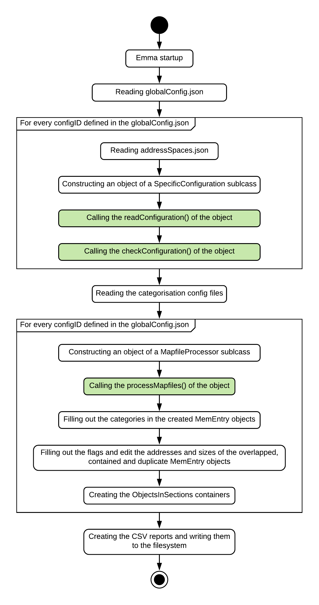

# Contribution guide
This guide will assist you in order to successfully submit contributions for the Emma project.  

## Obtain the current version of the source code
Assure that you are working with the latest stable version.

## Describe your changes
Absolutely describe your changes regardless of what problem you solved nor how complex your changes are. Keep the following points in mind:

### General
* What is your motivation to do to this change?
* Why it is worth fixing?
* How will it affect end-user?
* If optimisations were done - quantify them. Present trade-offs (e.g. run-time vs. memory).
* Evaluate your contribution objectively. What are pro's, con's?
* One contribution should solve only one problem. If not split it.
* Your description should be self-explanatory (avoiding external resources).

### Linking, referencing & documentation
* If you link to tickets/mailing lists etc. reference to them. Summarise what is its principal outcome.
* When referencing specific commits: state the commit ID (use the long hash) + (!) the commit massage in order to make it more readable for the reviewer.

### Implementation specific
* How you solved the problem?
* If your solution is complex: provide an introduction before going into details. 
* If your patch your solution describe what you have done and why.


## Test and review your code
Test it on a clean environment.

Review your code with regards to our [coding guidelines](#coding-guidelines).


## Check and act on the review process
You may receive comments regarding your submission. In order to be considered you must respond to those comments. 


## Sign your work
You must sign the [Developer Certificate of Origin (DCO)](https://developercertificate.org/) for any submission. We use this to keep track of who contributed what. Additionaly you certify that the contribution is your own work or you have the right to pass it on as an open-source patch.

**To do so you read the DCO and agree by adding a "sign-off" line at the end of the explanation of the patch like in the example below:**

```text
Signed-off-by: Joe Contrib <joe.contrib@somedomain.com>
```

Fill in your full name (no pseudonyms) and your email address surrounded by angle brackets.

Small or formal changes can be done in square bracket notation:

```
Signed-off-by: Joe Contrib <joe.contrib@somedomain.com>
[alice.maintain@somedomain.com: struct foo moved from foo.c to foo.h]
Signed-off-by: Alice Maintain <alice.maintain@somedomain.com>
```

## Do the pull request

```git
git request-pull master git://repo-url.git my-signed-tag
```

See also [here](https://help.github.com/en/articles/requesting-a-pull-request-review) for more information about pull requests in general on GitHub.


----------------------------------------------------------------
# Coding guidelines
Generally [PEP-8](https://github.com/python/peps/blob/master/pep-0008.txt) or the [Google style guide](https://github.com/google/styleguide/blob/gh-pages/pyguide.md) apply. However we deviate slightly from this (see the following sections). 

**If in doubt run [pylint](https://www.pylint.org/) by using our pylint configuration file (`.pylintrc`).**

## Style
* Naming conventions
    * mixedCase (camelCase and PascalCase is used)
    * **Methods/functions** and **variables** start with a minuscule (**camelCase**)
    * [**Class names**](https://www.python.org/dev/peps/pep-0008/#class-names) names start with a majuscule (**PascalCase**)
    * Global variables: `CAPS_WITH_UNDER`
* Max line length rule is ignored since it decreases readability, use line-breaks where appropriate
* Imports in Python
    * The imports need to be separated from other parts of the file with 2-2 blank lines above and under
    * They need to be grouped into the following three groups:
        * Python Standard Library Imports
        * 3rd Party Imports
        * Emma Imports
    * The groups need to be in the same order as in the previous list and they need to be separated from each other with a single blank line
    * Only packages and modules shall be imported, individual classes and functions not
    * Imports shall not use renaming
    * There are some exceptions:
        * Importing from shared_libs.stringConstants shall be done in the following way: `from shared_libs.stringConstants import *`
        * Importing the `pyipiscout` library shall be done in the following way: `import pypiscout as sc`
* British English shall be used in function names and comments
    * Exceptions:
        * `map file` is always written as `mapfile`
* `TODO`, `FIXME` and similar tags should be in the format: `# TODO: This is my TODO (<author>)`
    * First letter in the comment is a majuscule
    * The comment ends with the name of the author or with an unique and consistent abbreviation/alias/username/pseudonym (preferably your initials if still available; if you are unsure check the [CONTRIBUTORS](../CONTRIBUTORS) file)

## Path handling
Use `os.path.normpath()` where appropriate. Using `/` and `\` can cause problems between OSes (even on Windows with WSL) and strange things could happen. Also prefer `joinPath()` (in `shared_libs.Emma_helper`) instetad of `os.path.join()`.

## Raising exceptions
* Exceptions should be avoided where possible. Instead use a descriptive error message using `SCout` and exit with `sys.exit(<err-code>)`
* the default error code is `-10`
* For the user it is hard to distinquish whether an exception was caused by a bug or wrong user input

----------------------------------------------------------------
# Adding compiler support
The Emma tool was created in order to collect information from mapfiles and write them to CSV documents.
These mapfiles are created by the compiler during the compilation of a software and their format is specific to the compiler used.

Emma was designed in a way, that adding support for new compilers is possible with only minor changes to the existing codebase.
This chapter explains what are the new components that need to be added and how to integrate them into Emma.

## Compiler handling
The globalConfig.json file of a configuration lists the configId-s of the project (see doc/readme for more info on Emma configurations).
Every configId has a key "compiler" (for example see the **doc/test_project** configuration).
The value belonging to this key determines the classes used during runtime for the compiler specific tasks.

## New classes that need to be added
To implement the support for a new compiler, new classes need to be developed.
These will be responsible for reading the compiler specific parts of the configuration and for processing the mapfiles.
These classes should be located in the **emma_libs** folder, and it is recommended that they contain the name of the compiler they belong to as a prefix, for example: **emma_libs/ghsConfiguration.py**

These new classes need to provide a specific interface. For this reason the following classes need to be subclassed:  

* From **emma_libs/specificConfiguration.py**: `SpecificConfiguration`
* From **emma_libs/mapfileProcessor.py**: `MapfileProcessor`  

## Changes need to be done on the existing codebase 
In order to integrate these new classes, the following changes need to be made:

* Adding name string constant for the new compiler
    * The file **shared_libs/stringConstants.py** contains the names of the supported compiler
    * For consistency the name strings should follow the format defined in the [CMake documentation](https://cmake.org/cmake/help/v3.0/variable/CMAKE_LANG_COMPILER_ID.html)
    * Example: `COMPILER_NAME_GHS = "GHS"`
* Extending the SpecificConfiguration factory
    * The file **emma_libs/specificConfigurationFactory.py** contains the function `createSpecificConfiguration(compiler, **kwargs)`
    * This function is responsible for creating objects of subclasses of the `SpecificConfiguration` class that are specific to a compiler
    * Here, using the previously defined compiler name constant a new entry has to be made
* Extending the MapfileProcessor factory
    * The file **emma_libs/mapfileProcessorFactory.py** contains the function `createSpecificMapfileProcesor(compiler, **kwargs)`
    * This function is responsible for creating objects of subclasses of the `MapFileProcessor` class that are specific to a compiler
    * Here, using the previously defined compiler name constant a new entry has to be made

## Expected functionality of the new components
The previously mentioned abstract classes from which the new classes need to inherit, describe the prototypes of the methods that need to be implemented in their docstrings.
During runtime these methods (the ones with green background) will be called in the following order:

<div align="center">  </div>

The methods need to implement the following functionality:

* `readConfiguration()`
    * Process all the config files under the `configurationPath` that are belonging to the `configId`, the function was called with
    * Extend the `configuration` dictionary that was given to the function with the data extracted (this already contains the compiler independent configuration)
    * Collect the mapfiles from the `mapfilesPath` based on the configuration
  
* `checkConfiguration()`
    * Check whether the `configuration` belonging to the `configId` is valid, meaning that the mapfile processing will be possible with it
    * Return `True` for a valid `configuration`, `False` otherwise (in the `False` case, Emma might skip the mapfile processing for this `configId`)
  
* `processMapfiles()`
    * Create and return **two** lists of `MemEntry` objects that are representing the sections and objects found in the mapfiles respectively
    * The lists need to be ordered in an ascending order based on the `addressStart` of the `MemEntry` objects 
    * The following members need to be filled out in the `MemEntry` objects:
        * `configId`
        * `mapfileName`
        * `addressStart`
        * `addressLength` or `addressEnd`
        * `sectionName`
        * `objectName`
        * `compilerSpecificData`
    * Before returning, call the `MapfileProcessor::fillOutMemoryRegionsAndMemoryTypes()` on the created lists to fill out the `memTypeTag` and `memType` members

## Expected changes to project and documentation after adding a new compiler support
To make it possible for users and other contributors to easily get started with the added new support, the following non code related changes need to made:

* Add a test project with a step-by-step introduction to the **doc** folder. Take the **doc/test_project** as example.
* Add a chapter to the **doc/readme.md** describing the configuration of the new compiler. Take the chapter **Formal Definition of the GHS compiler specific configuration** as example.
* After changing the Markdown files, please re-generate the HTML files with the **genDoc/genReadmeHtmlFromMd.py** script, using the `--no_graphs` command line argument.

----------------------------------------------------------------
# Colour palette
The following colour palette is used for the documentation:

| Colour       | HSL(A)        | RGB(A)        | RGBA (hex) |
| ------------ | ------------- | ------------- | ---------- |
| Yellow       | 34, 255, 192  | 255, 230, 128 | ffe680ff   |
| Light orange | 17, 255, 213  | 255, 204, 170 | ffccaaff   |
| Dark orange  | 17, 145, 204  | 233, 198, 175 | e9c6afff   |
| Light blue   | 136, 145, 204 | 175, 221, 233 | afdde9ff   |
| Green        | 68, 145, 204  | 198, 233, 175 | c6e9afff   |
| Light grey   | 0, 0, 236     | 236, 236, 236 | ecececff   |
| Grey         | 0, 0, 204     | 204, 204, 204 | ccccccff   |
