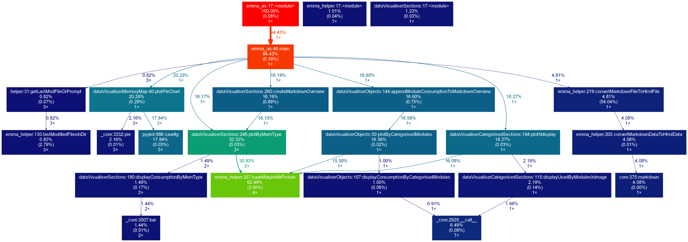

# Emma Visualiser
**Emma Memory and Mapfile Analyser Visualiser**

> Data aggregation and visualisation tool for Emma.

------------------------
# Contents
1. [Emma Visualiser](#emma-visualiser)
2. [Contents](#contents)
3. [Requirements](#requirements)
4. [Process](#process)
5. [Usage](#usage)
6. [Arguments in detail](#arguments-in-detail)
   1. [Optional Arguments](#optional-arguments)
   2. [Quiet Mode](#quiet-mode)
   3. [Overview](#overview)
   4. [Append Mode](#append-mode)
7. [Project Configuration](#project-configuration)
   1. [`budgets.json`](#budgetsjson)
   2. [`[supplement]`](#supplement)
8. [Input/Output Files](#inputoutput-files)
9. [Examples](#examples)
   1. [Calling Graph Emma Visualiser](#calling-graph-emma-visualiser)

------------------------

# Requirements
* Python 3.6 or higher
	* Tested with 3.6.1rc1; 3.7.0
* Python libraries
	* pypiscout 2.0 or higher: (`pip3 install pypiscout`)
	* Pandas 0.22 or higher: (`pip3 install pandas`)
	* Matplotlib 2.2.0 or higher: (`pip3 install matplotlib`)
	* Markdown 3.0.1 or higher: (`pip3 install Markdown`)
	* Pygments 2.3.1 or higher: (`pip3 install Pygments`)
* Tested on Windows and Linux systems

# Process

After analysing the mapfiles with the `emma.py` script, one can visualise them using `emma_vis.py`.

# Usage

    $ python emma_vis.py --help
    usage: Emma Visualiser [-h] [--version] --projectDir PROJECTDIR [--quiet]
                        [--append] [--inOutDir INOUTDIR] [--subDir SUBDIR]
                        [--overview] [--categorised_image_csv] [--noprompt]

    Data aggregation and visualisation tool for Emma Memory and Mapfile Analyser
    (Emma).

    optional arguments:
    -h, --help            show this help message and exit
    --version             Display the version number.
    --projectDir PROJECTDIR, -p PROJECTDIR
                            Path to directory holding the config files. The
                            project name will be derived from this folder name,
                            (default: None)
    --quiet, -q           Automatically accepts last modified .csv file in
                            ./memStats folder (default: False)
    --append              Append reports to file in ./results folder (default:
                            False)
    --inOutDir INOUTDIR, -i INOUTDIR
                            Path containing the memStats directory (-> Emma
                            output). If not given the `project` directory will be
                            used. (default: None)
    --subDir SUBDIR       Sub-directory of `inOutDir` where the Emma Visualiser
                            results will be stored. If not given results will be
                            stored in `inOutDir`. (default: None)
    --overview            Create a .html overview. (default: False)
    --categorised_image_csv, -cat_img
                            Save a .csv of categories found inside the image
                            summary (default: False)
    --noprompt            Exit program with an error if a user prompt occurs;
                            useful for CI systems (default: False)

    Copyright (C) 2019 The Emma authors License GPL-3.0: GNU GPL version 3
    <https://gnu.org/licenses/gpl.html>. This is free software: you are free to
    change and redistribute it. There is NO WARRANTY, to the extent permitted by
    law.

# Arguments in detail
## Optional Arguments

* `--inOutDir INOUTDIR, -i INOUTDIR`
* `--subDir SUBDIR`

User defined path for the folder `./memStats` holding generated statistics from Emma. If not specified the schema below will be followed:

| Argument -> | `--projectDir` | `--inOutDir` | `--subDir` | I/O path                |
| ----------- | -------------- | ------------ | ---------- | ----------------------- |
| Given?      | x              |              |            | projectDir              |
| Given?      | x              | x            |            | inOutDir                |
| Given?      | x              | x            | x          | join(inOutDir + subDir) |

I/O path denotes the path containing `memStats`. In the same path the `results` folder will be created.

By defining `SUBDIR` a folder with the given name is created in the results directory. This option makes it easier to distinguish between different development stages when batch analysing mapfiles.

* `--append`

Additional reports in .csv format will be created in the ./results directory.

* `--categorised_image_csv, -cat_img`
Save a .csv of categories found inside the image summary (default: False).

## Quiet Mode

* `--quiet, -q`

Automatically accepts last modified `.csv` file in `./memStats` folder (default: False). If not specified the program will ask you to confirm the default path if not given or ambiguous.

## Overview

* `--overview`

This creates a .md and .html output containing an overview of the memory usage.

## Append Mode

* `--append`

Appends analyses to .csv files. This can be used to visualise memory usage over different versions.

# Project Configuration

There are several configuration files needed in order to analyze your project. Most of them are described in the Emma documentation.
Here, only the ones described that are used by the Emma Visualiser exclusively.

## `budgets.json`

This config file is used to define the available memory for every memory area of every configID.
Besides this it defines a threshold value as well that will be displayed on the diagrams. This threshold can be for example
prescribed by your project requirements in order to ensure there will be available memory areas for future updates.

The config file needs to have the following format:

{
    "Project Threshold in %": <THRESHOLD_VALUE>,

    "Budgets": [
        [<CONFIG_ID>, <MEMORY_TYPE>, <AVAILABLE_MEMORY>],
        .
        .
        .
        [<CONFIG_ID>, <MEMORY_TYPE>, <AVAILABLE_MEMORY>]
    ]
}

The following rules apply:

* The file contains a single unnamed JSON object
* The types used in the description:
    * `<THRESHOLD_VALUE>` is an integer
    * `<CONFIG_ID>` is a string
    * `<MEMORY_TYPE>` is a string containing one of the following values:
        * "INT_RAM" - internal RAM
        * "EXT_RAM" - external RAM
        * "INT_FLASH" - internal Flash
        * "EXT_FLASH" - external Flash
    * `<AVAILABLE_MEMORY>` is an integer
* The `<THRESHOLD_VALUE>` defines the project in percents
* The `"Budgets"` array has to contain a line for every `<MEMORY_TYPE>` of every `<CONFIG_ID>`
* The `<CONFIG_ID>`s are the ones defined in the globalConfig.json (See the Emma documentation for details)
* The `<AVAILABLE_MEMORY>`s are defining the available memory for a `<MEMORY_TYPE>` of a `<CONFIG_ID>` in bytes

## `[supplement]`
`.md` files in this directory will be appended to the report created by the `--overview` command.
This can be used to append additional remarks to the overview.
This is completely user defined, Emma and its components are not relying on these files in any way.

# Input/Output Files
All output files will be saved to `./[PROJECT]/results`.

If not specified otherwise using the `--quiet` and `--inOutDir` commands, the visualiser will choose the last modified image and module summary .csv files in the `./[PROJECT]/memStats` directory. If there is no module summary present the visualisation of the modules will be skipped.

Output files are:

* `.png`'s of all plots
* Overview mode creates `.md` and `.html` files of the overview
* A `.csv` file showing which section contains which modules

# Examples
After the Image Summary has been created with emma.py and the memStats CSV files were saved to the directory `../[PROJECT]/results/memStats`, it can be visualised using:

    :::bash
    python emma_vis.py \
    --project ..\[PROJECT] \
    --dir ..\[PROJECT]\results \
    --quiet \
    --overview

## Calling Graph Emma Visualiser

  

