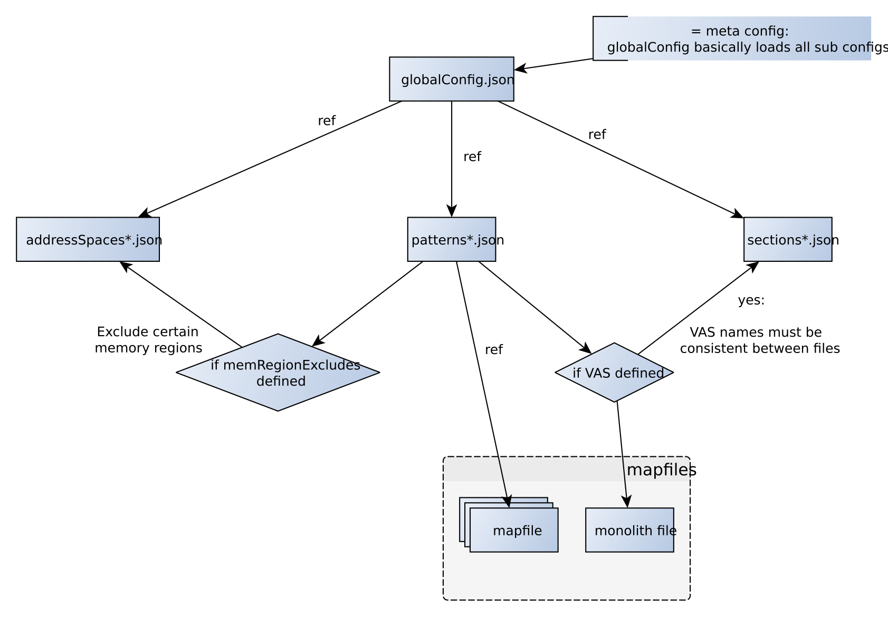
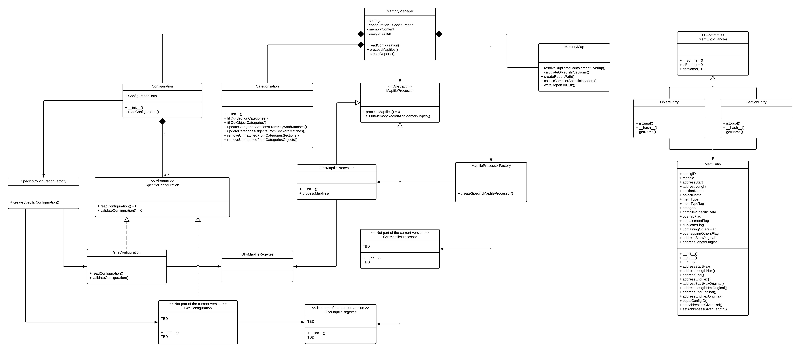
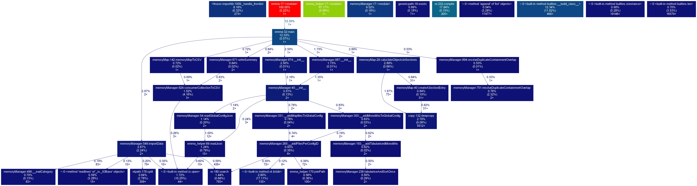

# Emma
**Emma Memory and Mapfile Analyser**

> Conduct static (i.e. worst case) memory consumption analyses based on linker map files (currently only Green Hills map files are supported).
This tool creates a summary/overview about static memory usage in form of a comma separated values (CSV) file.

------------------------
# Contents
1. [Emma](#emma)
2. [Contents](#contents)
3. [Requirements](#requirements)
4. [Process](#process)
5. [Limitations](#limitations)
6. [Usage](#usage)
7. [Arguments](#arguments)
   1. [Required Arguments](#required-arguments)
   2. [Optional Arguments](#optional-arguments)
8. [Project Configuration](#project-configuration)
   1. [Formal Definition](#formal-definition)
      1. [`[<PROJECT>]`](#project)
      2. [`[supplement]`](#supplement)
      3. [`globalConfig.json`](#globalconfigjson)
      4. [`address spaces*.json`](#address-spacesjson)
      5. [`budgets.json`](#budgetsjson)
      6. [`patterns*.json`](#patternsjson)
      7. [`virtualSections*.json`](#virtualsectionsjson)
      8. [`categoriesObjects.json` and `categoriesSections.json`](#categoriesobjectsjson-and-categoriessectionsjson)
      9. [`categoriesObjectsKeywords.json` and `categoriesSectionsKeywords.json`](#categoriesobjectskeywordsjson-and-categoriessectionskeywordsjson)
   2. [Configuration File Dependencies](#configuration-file-dependencies)
9. [Output Files](#output-files)
   1. [Image Summary](#image-summary)
   2. [Module Summary](#module-summary)
   3. [Objects in Sections](#objects-in-sections)
   4. [CSV header](#csv-header)
10. [Terminology](#terminology)
11. [Examples](#examples)
   1. [Matching module name and category using `categoriesKeywords.json`](#matching-module-name-and-category-using-categorieskeywordsjson)
   2. [Removing not needed module names from `categories.json`](#removing-not-needed-module-names-from-categoriesjson)
12. [General Information About Map Files and Build Chains](#general-information-about-map-files-and-build-chains)
13. [Technical Details](#technical-details)
   1. [GHS Monolith file generation](#ghs-monolith-file-generation)
   2. [Class diagram Emma](#class-diagram-emma)
   3. [Calling Graph Emma](#calling-graph-emma)

------------------------

# Requirements
* Python 3.6 or higher
    * Tested with 3.6.1rc1; 3.7.0
* Python libraries
    * pypiscout 2.0 or higher: (`pip3 install pypiscout`)
* Tested on Windows and Linux systems


# Process
Using the Mapfile Analyser is a two step process. The first step is to extract the required information from the mapfiles and save it to .csv files.
This is done with the `emma.py` script. The second step is to visualise the data. This document explains the first part only, the visualisation is documented in the Emma visualiser readme document.

# Limitations
The Emma is only suitable for analyzing projects where the devices have a single linear physical address space:

* Devices that use for example the Intel 8051 architecture have separate code and data address spaces that both
    start at address 0x0000. Devices based on architectures like this can not be analyzed with Emma.
* Devices that use for example the ARMv6M architecture have a single linear address space.
    Devices based on architectures like this can be analyzed with Emma.

# Usage
Image and module summaries of the specified mapfiles will be created.

    $ python emma.py --help
    usage: Emma Memory and Mapfile Analyser (Emma) [-h] [--version] --project PROJECT
                                               --mapfiles MAPFILES [--dir DIR]
                                               [--subdir SUBDIR] [--analyse_debug]
                                               [--create_categories]
                                               [--remove_unmatched] [--noprompt]
                                               [-Werror]

    Analyser for mapfiles from Greens Hills Linker (other files are supported via
    configuration options).It creates a summary/overview about static memory usage
    in form of a comma separated values file.

    optional arguments:
      -h, --help           show this help message and exit
      --version            Display the version number.
      --project PROJECT    Path of directory holding the configuration.The project
                           name will be derived from the the name of this folder.
                           (default: None)
      --mapfiles MAPFILES  The folder containing the mapfiles that needs to be
                           analyzed. (default: None)
      --dir DIR            Output folder holding the statistics. (default: None)
      --subdir SUBDIR      User defined subdirectory name in the --dir folder.
                           (default: None)
      --analyse_debug      Include DWARF debug sections in analysis (default:
                           False)
      --create_categories  Create categories.json from keywords. (default: False)
      --remove_unmatched   Remove unmatched modules from categories.json.
                           (default: False)
      --noprompt           Exit fail on user prompt. (default: False)
      -Werror              Treat all warnings as errors. (default: False)

    ********* Marcel Schmalzl, Felix Mueller, Gergo Kocsis - 2017-2019 *********


# Arguments
## Required Arguments

    --project PROJECT, -p PROJECT

    --mapfiles MAPFILES, --map MAPFILES

## Optional Arguments

    --dir
        User defined path for the top folder holding the `memStats`/output files.
        Per default it uses the same directory as the config files. 

    --stats_dir
        User defined path inside the folder given in the `--dir` argument.
        This is usefull when batch analysing mapfiles from various development stages.
        Every analysis output gets it's own directory. 

    --create_categories, -ctg
        Create categories.json from keywords.json for easier module categorisation.

    --remove_unmatched, -ru
        Remove unmatched entries from categories.json. This is usefull when a categories.json from another project is used.

    --help, -h

    --dir STATS_DIR, -d STATS_DIR
        User defined path for the folder `memStats` holding generated statistics from Emma (default: ./memStats).

    --analyse_debug, --dbg
        Normally we remove DWARF debug sections from the analysis to show the relevant information for a possible release software.
        This can be prevented if this argument is set. DWARF section names are defined in stringConstants.py
        `.unused_ram` is always excluded (regardless of this flag)
        
    --noprompt
        Exit and fail on user prompt. Normally this happens when some files or configurations are ambiguous.
        This is useful when running Emma on CI systems.

    -Werror


# Project Configuration

The memory analysis will be executed based on the project configuration. In order to be able to use Emma with your project,
you need to create a configuration matching your project's hardware and software.
The configuration has to be established correctly, because **errors made in it, can distort the memory analysis results or it will be refused by Emma**.

This chapter explains the role and functionality of each part of the configuration and illustrates all the settings that can be used.
Based on this description the user will have to create his/her own configuration.

Creating a configuration is done by writing several JSON files (if you are not familiar with JSON, please visit https://www.json.org).
This chapter will go trough the topic by formally defining the format, rules and the functionality of the config files.
There are practical example projects available in the doc folder available. These projects will lead you step by step trough the process of 
creating a configuration and they also contain map files that can be analyzed.

The following example projects are available:  

* **doc/test_project** - A Test Project that illustrates a system with a hardware that consists of two devices: an MCU and an SOC.
The mapfiles of this project are using the default mapfile format of Emma.

## Formal Definition

An Emma project configuration contains several JSON files:

    +--[<PROJECT>]
    |   +-- [supplement]
    |   +-- globalConfig.json
    |   +-- addressSpaces*.json
    |   +-- patterns*.json
    |   +-- virtualSections*.json
    |   +-- budgets.json
    |   +-- categoriesObjects.json
    |   +-- categoriesObjectsKeywords.json
    |   +-- categoriesSections.json
    |   +-- categoriesSectionsKeywords.json

The files containing the asterisk symbol can be freely named by the user because the actual file names will have to be
listed in the globalConfig.json.

### `[<PROJECT>]`
The configuration has to be contained by a folder. The name of the folder will be the name of the configuration.
From the files ending with a * symbol, the configuration can contain more than one but maximum up to the number of configIDs defined in globalConfig.json.

### `[supplement]`
You can add .md files into this folder with mark down syntax to add information regarding your project that will be contained by the .html overview.
For more information please refer to the Emma Visualiser's documentation.

### `globalConfig.json`
The globalConfig.json is the starting point of the configurations.
It defines the used compiler, the memory configurations of the system and the names of the config files that belong to these.
A memory configuration is describes a unit that has memory associated to it, for example an MCU, MPU or an SOC.
During the analysis, it will be examined to which extent the memory resources that are available for these units are used.
A compiler definition is used for determining the mapfile format.

In Emma, a memory configuration is called a **configID**. For each configID the the following config files need to be defined:

<div align="center">  </div>

The globalConfig.json has to have the following format:

    :::json
    {
        <CONFIG_ID>: {
            "compiler": <COMPILER_NAME>,
            "addressSpacesPath": <CONFIG_FILE>,
            "patternsPath": <CONFIG_FILE>,
            "virtualSectionsPath": <CONFIG_FILE>,
            "ignoreConfigID": <BOOL>
        },
        .
        .
        .
        <CONFIG_ID>: {
            "compiler": <COMPILER_NAME>,
            "addressSpacesPath": <CONFIG_FILE>,
            "patternsPath": <CONFIG_FILE>,
            "virtualSectionsPath": <CONFIG_FILE>,
            "ignoreConfigID": <BOOL>
        }
    }

The following rules apply:

* The file contains a single unnamed JSON object
* The types used in the description:
    * `<COMPILER_NAME>` is a string
    * `<CONFIG_ID>` is a string
    * `<CONFIG_FILE>` is a string 
    * `<BOOL>` is a boolean value containing either **true** or **false**  
* There has to be at least one **configID** defined
* You must define a compiler for each configID by defining the **compiler** key. The possible values are:
    * "GHS" - Green Hills Compiler
* You must assign three config files for each configID by defining the following key, value pairs:
    * by defining **addressSpacesPath**, the config file that defines the address spaces is assigned
    * by defining **patternsPath**, the config file that defines the patterns is assigned
    * by defining **virtualSectionsPath**, the config file that listing the sections of the virtual address spaces is assigned
    * The config files have to be in the same folder as the globalConfig.json
    * The config files don't need to be different for each configID (for example you can use the same sections config file for all the configIDs)
* The ignoreConfigID:
    * can be used to mark a configID as ignored, which means that this will not be processed during the analysis
    * is optional, it does not need to be included in every configID, leaving it has the same effect as including it with false

### `address spaces*.json`
The address spaces config files define the existing memory areas for the configIDs they were assigned to in the globalConfigs.json.

These config files have to have the following format:

    :::json
    {
        "offset": <ADDRESS>,
        "memory": {
            <MEMORY_AREA>: {
                "start": <ADDRESS>,
                "end": <ADDRESS>,
                "type": <MEMORY_TYPE>
            },
            .
            .
            .
            <MEMORY_AREA>: {
                "start": <ADDRESS>,
                "end": <ADDRESS>,
                "type": <MEMORY_TYPE>
            }
        },
        "ignoreMemory": [
            <MEMORY_AREA>, ... <MEMORY_AREA>
        ]
    }

The following rules apply:

* The file contains a single unnamed JSON object
* The types used in the description:
    * `<ADDRESS>` is a string containing a 64bit hexadecimal value, for example "0x1FFFFFFF" 
    * `<MEMORY_AREA>` is a string containing a unique name
    * `<MEMORY_TYPE>` is a string containing one of the following values:
        * "INT_RAM" - internal RAM
        * "EXT_RAM" - external RAM
        * "INT_FLASH" - internal Flash
        * "EXT_FLASH" - external Flash     
* The **offset** is a global address offset applied to all addresses in the file
* **memory** is a JSON object that defines the memory areas
* Each memory area is a JSON object that has three elements:
    * start - start address
    * end - end address
    * type - memory type
* The **ignoreMemory** is a JSON array used to mark one or more `<MEMORY_AREA>` to be ignored during the analysis:
    * The the elements of this array can be selected from the ones defined in the "memory" object
    * It is optional, not including it or including it as an empty array means none of the `<MEMORY_AREA>`s are ignored

### `budgets.json`
The budgets config file belongs to the Emma Visualiser. For a description, please see: **doc\readme-vis.md**.

### `patterns*.json`
The patterns config files define regex patterns for finding the mapfiles, monolith files and processing their content.
They belong to the configID they were assigned to in the globalConfigs.json.

These config files have to have the following format:

    :::json
    {
        "mapfiles": {
            <SW_NAME>: {
                "regex": [<REGEX_PATTERN>, ... <REGEX_PATTERN>],
                "VAS": <VAS_NAME>,
                "UniquePatternSections": <REGEX_PATTERN>,
                "UniquePatternObjects": <REGEX_PATTERN>,
                "memRegionExcludes": [<MEMORY_AREA>, ... <MEMORY_AREA>]
            },
            .
            .
            .
            <SW_NAME>: {
                "regex": [<REGEX_PATTERN>, ... <REGEX_PATTERN>],
                "VAS": <VAS_NAME>,
                "UniquePatternSections": <REGEX_PATTERN>,
                "UniquePatternObjects": <REGEX_PATTERN>,
                "memRegionExcludes": [<MEMORY_AREA>, ... <MEMORY_AREA>]
            },
        },
        "monoliths": {
            "<MONILITH_NAME>": {
                "regex": [<REGEX_PATTERN>, ... <REGEX_PATTERN>]
            }
        }
    }

The following rules apply:

* The file contains a single unnamed JSON object
* The types used in the description:
    * `<SW_NAME>` is a string containing a unique name
    * `<REGEX_PATTERN>` is a string containing a regex pattern following the format used by the "re" Python library
    * `<VAS_NAME>` is a string
    * `<MONOLITH_NAME>` is a string containing a unique name
* The **mapfiles** object must be present in the file with at least one entry:
    * Each entry describes a SW unit of the configId (eg. a bootloader or application if an MCU is used or a process if an OS, like Linux is used):
        * The **regex** defines one ore more regex pattern to find the mapfile that contains the data for this SW unit:
            * It is possible to give more than one regex patterns in case of non-uniform mapfile names
            * If more than one map file will be found for the SW unit, a warning will be thrown
            * The search will be done in the mapfile folder defined by the command line arguments
        * The **VAS** is optional element, defining the name of the virtual address space of this SW unit
            * It is only required if the SW unit has entries that belong to virtual address spaces
            * More than one mapfiles can contain data belonging to one virtual address space, so the VAS name does not need to be unique
        * The **UniquePatternSections** is an optional element defining a regex pattern for collecting the sections from the mapfile
            * It only needs to be defined if the default regex pattern has to be overridden
            * This can be necessary if the toolchain where the mapfile coming from, produces another format
        * The **UniquePatternObjects** is an optional element defining a regex pattern for collecting the objects from the mapfile
            * It only needs to be defined if the default regex pattern has to be overridden
            * This can be necessary if the toolchain where the mapfile coming from, produces another format
        * The **memRegionExcludes** lists the memory areas that needs to be ignored during the analysis of the mapfile
            * The sections and objects of the mapfile that belong to the memory areas listed here will be ignored
            * The memory areas can be selected from the <MEMORY_AREA> elements defined in the "memory" object of address spaces config file
* The **monoliths** object is optional, it is only needed if the configId has virtual address spaces
    * If one the of the mapfiles object has a VAS key, then a monolith is needed
    * It is possible to give more than one regex patterns in case of non-uniform monolith file names
    * If more than one monolith file will be found for the SW unit, a warning will be thrown
    * The search will be done in the mapfile folder defined by the command line arguments

### `virtualSections*.json`
The virtual sections config files are used to assign the sections of the virtual address spaces to
a virtual address spaces defined in the `patterns*.json`file. This is needed because the mapfiles can contain physical
and virtual sections as well and Emma needs to identify the virtual ones and assign them to a specific virtual address space.
If your configuration does not use virtual address spaces, the virtualSections*.json files are not needed.

This config file have to have the following format:

    :::json
    {
        <VAS_NAME>: [
            <SECTION_NAME>,
            .
            .
            .
            <SECTION_NAME>
        ],
        ...
        <VAS_NAME>: [
            <SECTION_NAME>,
            .
            .
            .
            <SECTION_NAME>
        ]
    }

The following rules apply:

* The file contains a single unnamed JSON object
* The types used in the description:
    * `<VAS_NAME>` is a string
    * `<SECTION_NAME>` is a string
* The `<VAS_NAME>` keys are the ones that were defined in the `patterns*.json`
* Every `<VAS_NAME>` key has an array as value that lists the sections that belong to the virtual address space 
* There are no rules for the assignment, this needs to be done intuitively based on the project being analyzed

### `categoriesObjects.json` and `categoriesSections.json`
The categories config files are used to categorize objects and sections to user defined categories by using their full names.
These files are optional, if no categorization needed, these config files do not need to be created.
This function can be used for example to group the software components of one company together which will make the results easier to understand.

The `categoriesObjects.json` is used for the objects and the `categoriesSections.json` is  used for the section categorization.
The objects and sections will be first tried to be categorized by these files. If they could not be categorized, then the software will try
to categorize them based on the `categoriesObjectsKeywords.json` and `categoriesSectionsKeywords.json` files.

These config files have to have the following format:

    :::json
    {
        <CATEGORY>: [
            <NAME>,
            .
            .
            .
            <NAME>
        ],
        .
        .
        .
        <CATEGORY>: [
            <NAME>,
            .
            .
            .
            <NAME>
        ]
    }

The following rules apply:

* The file contains a single unnamed JSON object
* The types used in the description:
    * `<CATEGORY>` is a string containing a unique category name
    * `<NAME>` is a string
* The categorisation can be done either by hand or with the **--create_categories** command line argument (for usage see there)
* The `<NAME>` has to contain full names of the sections or objects

### `categoriesObjectsKeywords.json` and `categoriesSectionsKeywords.json`
The categories keywords config files are used to categorize objects and sections to user defined categories by using only substrings of their names.
These files are optional, if no categorization needed, these config files do not need to be created.
This function can be used for example to group the software components of one company together which will make the results easier to understand.

The `categoriesObjectsKeywords.json` is used for the objects and the `categoriesSectionsKeywords.json` is  used for the section categorization.
The objects and sections will only tried to be categorized by these files if the categorization by the `categoriesObjects.json` and `categoriesSections.json` files failed.
If they could not be categorized, then the software will assign them to a category called `<unspecified>` so they will be more visible in the results.

These config files have to have the following format:

    :::json
    {
        <CATEGORY>: [
            <KEYWORD>,
            .
            .
            .
            <KEYWORD>
        ],
        <CATEGORY>: [
            <KEYWORD>,
            .
            .
            .
            <KEYWORD>
        ]
    }

The following rules apply:

* The file contains a single unnamed JSON object
* The types used in the description:
    * `<CATEGORY>` is a string containing a unique category name
    * `<KEYWORD>` is a string
* The categorisation has to be done by hand
* The `<KEYWORD>` contains a regex pattern for the names of the sections or objects

## Configuration File Dependencies
In order to work correctly Emma expects certain relations between configuration files. This section shall provide an overview:

<div align="center">  </div>

Since `globalConfig.json` is "just" a meta-config you reference filenames of

1. `addressSpaces*.json`
2. `patterns*.json` and
3. `sections*.json`.

These filenames must (obviously) match with the real filenames - there are referenced (`ref`).

`memRegionExcludes`: You can exclude certain memory regions with this keyword in `patterns*.json`. In order to do this the memory regions/tags must match with those defined in `addressSpaces*.json`.

If you have virtual address spaces (VASes) defined. We need a "monolith file" pattern defined in `patterns*.json` in order to be able to translate virtual addresses back to physical addresses. In the same file you give each VAS a name/tag. This tag is later used to identify which section belongs to which VAS (defined in `sections*.json`). Again, the VAS names must match between those two files. We do this since you may have name clashes of sections names between different VASes.


# Output Files
The output Files will be saved to the memStats folder of the respective project. The filename will have this form: 

    :::bash
    <PROJECT_NAME>_Image_Summary_TIMESTAMP.csv
    <PROJECT_NAME>_Module_Summary_TIMESTAMP.csv
    <PROJECT_NAME>_Objects_in_Sections_TIMESTAMP.csv

## Image Summary

The file `<PROJECT_NAME>_Image_Summary_<TIMESTAMP>.csv` contains the sections from the mapfiles.

## Module Summary

The file `<PROJECT_NAME>_Module_Summary_<TIMESTAMP>.csv` contains the objects from the mapfiles.

## Objects in Sections
"Objects in sections" provides ways to obtain a finer granularity of the categorisation result. Therefore categorised sections containing (smaller) objects of a different category got split up and result into a more accurate categorisation. As a result you will get output files in form of a `.csv` file which sets you up to do later processing on this data easily. In this file additional information is added like:

* Overlaps (of sections/objects)
* Containments (e.g. sections containing objects)
* Duplicates
* All meta data about the origin of each section/object (mapfile, addess space, ...)
* ...

<div align="center">  </div>

The file `<PROJECT_NAME>_Objects_in_Sections_<TIMESTAMP>.csv` is the result of the "merge" of the objects and the sections file.

Objects/sections that are "touching" or overlapping each other in some way (see the above figure) are resolved in this step. Therefore the "weaker" section/object is split (and has therefore a reduced by size after each step).

This is done so that the file represents a continuous and refined memory mapping. Furthermore it is checked whether sections/objects overlap, contain or duplicate each other.

The information on such occurrences can be observed in the rightmost columns:

* `overlapFlag`: Overlaps with the stated section
* `containmentFlag`: Is contained by the stated section
* `duplicateFlag`: Duplicate entry
* `containgOthers`: Contains stated sections/objects
* `addrStartHexOriginal`: Address before correction (in contrast to the "new" addresses due to the above actions)
* `addrEndHexOriginal`: Address before correction (in contrast to the "new" addresses due to the above actions)

The above figure also shows how sizes of objects/sections are calculated correctly (-> namely: `start - end + 1`). Besides this a specific case of an overlap is shown above. A section/object having the same end address like the start address of another section/object. This happens to be already an overlap of one byte.

As a result you see the `+ 1` addition for the size calculation.
This might sound counter-intuitive at the first spot. However we can see memory addresses as memory blocks itself rather than infinitesimal barriers (what the term start and end address would intuitively suggest by its name).

At the end you will find three remaining "types":

1. **Real objects:** (Un)modified objects due to the above actions
2. **Section reserves:** Resolved sections minus resolved objects; this is what remains when you resolve all "touching" occurrences and subtract objects from sections that we obtain (multiple) smaller sections
3. **Section entry:** The original section size (without any modification); this is a pure virtual entry and has a size of `0` bytes; these are the only `0` byte sections which are a result of the Emma processing

Section names for section reserves and entries are `<Emma_SectionReserve>` and `<Emma_SectionEntry>` respectively. The `<Emma_xxxx>` pattern shows you names introduced by Emma.

## CSV header
The CSV file has the following columns:

* The address start, end and sizes: `addrStartHex; addrEndHex; sizeHex; addrStartDec; addrEndDec; sizeDec; sizeHumanReadable`
* The section and module name: `section; moduleName` Note: If the image summary contains only sections, the column moduleName will be left empty.
* `configID`, `memType` and `tag` are from the config files.
* `vasName` is the virtual address space name defined in sections.json. The `DMA` field indicates whether a section/module is in a VAS. 
* `category`: The category evaluated from categories*.json
* `mapfile`: The mapfile, the entry originates from.
* `overlapFlag`: Indicates whether one section overlaps with another.
* `containmentFlag`: Indicates whether a section is contained in another.
* `duplicateFlag`: Indicates whether a section has duplicates.

# Terminology
In places there is some specific terminology used which is explained in the following chapter:

* DMA: Direct Memory Addressing; addresses which do not have to be translated (from virtual to physical); this has nothing to do with direct access to memory on the target (by bypassing the CPU core(s))
* Emma was formerly known as MAdZ

# Examples
Create a Mapfile Summary for <PROJECT>:

    :::bash
    emma.py --project ..\<PROJECT> \
    --mapfiles ..\MyMapfiles \
    --dir ..\MyMapfiles\results

## Matching module name and category using `categoriesKeywords.json`
`categoriesKeywords.json` can be used to match module names with catgories by user defined keywords.

* Arguments required:  ```--create_categories```
* This step will append the newly categorised modules to `categories.json`. The program will ask you to confirm to overwrite the file.

## Removing not needed module names from `categories.json`
Not needed module names can be removed from `categories.json`, for example when `categories.json` from another project is used.

* Arguments required:  ```--remove_unmatched```
* This step will remove never matching module names from `categories.json`. Some modules never match because e.g. the module got removed or is not present in the current release. The program will ask you to confirm to overwrite the file.


# General Information About Map Files and Build Chains
* [COMPILER, ASSEMBLER, LINKER AND LOADER: A BRIEF STORY](http://www.tenouk.com/ModuleW.html)
* [Hello World: C, Assembly, Object File and Executable](http://resources.infosecinstitute.com/hello-world-c-assembly-object-file-and-executable)
* [Analyzing the Linker Map file with a little help from the ELF and the DWARF](https://www.embeddedrelated.com/showarticle/900.php)
* [Anatomy of a Program in Memory](http://duartes.org/gustavo/blog/post/anatomy-of-a-program-in-memory)
* [Memory Management: Paging](https://www.cs.rutgers.edu/~pxk/416/notes/10-paging.html)
* [Beginner's Guide to Linkers](http://www.lurklurk.org/linkers/linkers.html)
* [Linker Scripts](http://www.scoberlin.de/content/media/http/informatik/gcc_docs/ld_3.html)


# Technical Details
## GHS Monolith file generation
Execute this to generate the monolith files (you need to have the ELF file for this step).

    :::bash
    gdump.exe -virtual_mapping -no_trunc_sec_names Application.elf >> monolith.map
    gdump.exe -map             -no_trunc_sec_names Application.elf >> monolith.map

By default long names will be truncated. This can lead to inaccurate results. In order to prevent this use `-no_trunc_sec_names`.

## Class diagram Emma
<div align="center">  </div>

## Calling Graph Emma
<div align="center">  </div>
