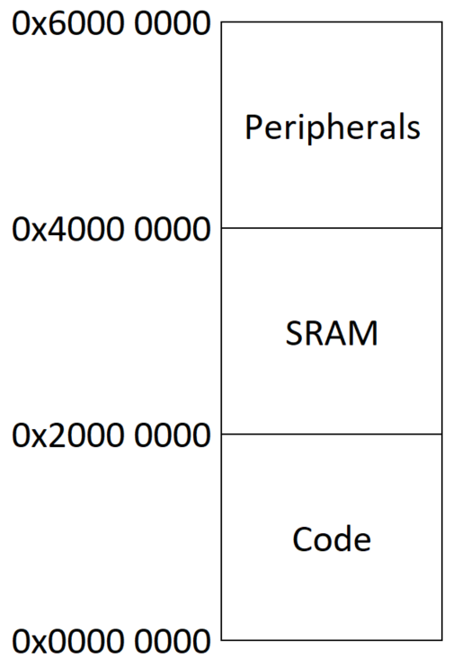
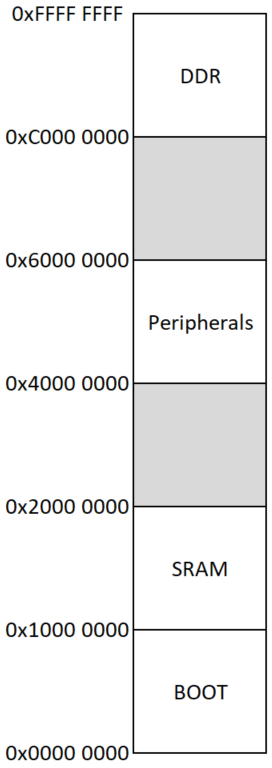

# Test Project
This is an imaginary system, the mapfiles were created by hand and they are following the default Emma mapfile format.
The goal of the project is to present a simple system without any complicated parts in order
to introduce the new users step-by-step to creating an Emma configuration.

The project can be analysed by running the following commands from the Emma top-level folder:

Emma:

```bash
python Emma.py a --project doc/test_project --mapfiles doc/test_project/mapfiles
```

Emma Visualier:

```bash
python Emma.py v --project doc/test_project --dir doc/test_project/results --overview --quiet
```

The folder structure of the Test Project:

```text
+--[test_project]
|   +-- [mapfiles]                          # The mapfiles of the project are stored here
|   +-- [readme]                            # The folder of this description
|   +-- [results]                           # The results of the analyse will be stored here by the commands above
|   +-- [supplement]                        # Supplements to the result overview (see Emma Visualiser documentation)
|   +-- globalConfig.json
|   +-- addressSpaces_MCU.json
|   +-- addressSpaces_SOC.json
|   +-- patterns_MCU.json
|   +-- patterns_SOC.json
|   +-- virtualSections_SOC.json    
|   +-- categoriesObjects.json
|   +-- categoriesSections.json
|   +-- categoriesObjectsKeywords.json    
|   +-- categoriesSectionsKeywords.json
```

## Project description
The project illustrates a system with a hardware that consists of two devices: an MCU and an SOC.


### MCU
The MCU software consists of two firmware, the application and the bootloader.
Both of them are loaded into the internal Flash, but they are never running at the same time.
They share the same stack area and none of them have a heap. Besides the internal Flash and RAM available on the MCU,
there is an external Flash available trough SPI for the software to use. After a system start-up, the execution will be
given to the Bootloader.

The function of the bootloader is to check version number and the CRC value of the application firmware
and in case an update is needed, (newer firmware available or CRC error of the current one) try to update it.
The firmware for the update is stored in the external flash. The bootloader is a bare-metal firmware,
it does not use an operating system.

The function of the application is to load the parameter set from the external Flash memory and  run a complex CAN stack.
It implements a connection based protocol called `CAN_PROT`. The protocol makes the Application firmware able to
receive a firmware update which will then be stored in the external Flash. After executing the reset command received
trough the CAN stack, the Bootloader can flash the application if all the firmware checks pass. The application has a
simple RTOS running on it called OS.

The memory layout of the MCU:

<div align="center">  </div>


### SOC
The SOC is running a complex operating system that utilizes the memory management unit (MMU) of the processor.
The software running on the SOC contains multiple virtual address spaces. Besides the operating system,
there are two processes running on the chip: the NetLogger and the application.

The NetLogger is a logging framework, trough which the software can be remotely monitored. The log messages are
sent from other processes trough the IPC service provided by the operating system. These messages can be accessed
and filtered by a remote client trough a TCP/IP connection.

The application is handling a capacitive touchscreen trough the Gfx graphics library and other software components.
It is presenting animations to the user, which he can control trough the touch screen. The application is creating
log messages about every event that occurs trough the NetLog library. The NetLog library will transfer the log messages
to the NetLogger framework if available on the system.

The memory layout of the SOC:

<div align="center">  </div>


## Creating the configuration
This chapter will explain creating the configuration for the project by explaining every step the user should take.

### globalConfig.json
Creating the project configuration starts with creating the `globalConfig.json`. This file lists the programmable devices of
the system and assigns the further configuration files to configuration.

We will add our two devices (MCU and SOC) as JSON objects. For every device, the used compiler and at least two config files must be assigned:
the addressSpaces and the patterns. For devices using virtual address spaces, a third one, the sections is needed as well.
As we are using Green Hills Compiler, so the mapfiles will be in this format, we will define the value `GHS` for both of the devices.

Since in our system, we have different devices with different memory layout, we have assigned two different addressSpaces
config files to them. If your system contains multiple devices of the same type, you can use the same
addressSpaces config file for these devices.

The patterns config file files are usually unique for all the configIDs.

Since the MCU does not have an MMU so it does not have virtual address spaces, we will not assign a sections config file to it.
In contrast to the MCU, the SOC does use virtual address spaces, so we will assign a sections config file to it.

```json
{
    "MCU": {
        "compiler": "GHS",
        "addressSpacesPath": "addressSpaces_MCU.json",
        "patternsPath": "patterns_MCU.json"
    },
    "SOC": {
        "compiler": "GHS",
        "addressSpacesPath": "addressSpaces_SOC.json",
        "patternsPath": "patterns_SOC.json",
        "virtualSectionsPath": "virtualSections_SOC.json"
    }
}
```

In the following, the config files assigned to the MCU will be explained.

### addressSpaces_MCU.json
In this config file, the memory areas of the MCU will be defined. You can collect information on them from the data sheet of the
device. For every memory area, we have to define the `start` and `end` addresses in bytes and assign a `type` to it as well.
For the possible values of the "type", see the Emma documentation.

For the MCU used in the system, the following memory areas are available: `Code`, `SRAM` and `Device`.
The `Code` area is an internal Flash area, where the program and the constants will be stored.
The `SRAM` area is an internal RAM area, where data is stored. The last area is the `Device`,
where the SFRs of the controller are located. Since our software will have neither data nor code in this area,
we will add it to the `ignoreMemory` array so it will not be a analysed by Emma.

```json
{
    "memory": {
        "Code": {
            "start": "0x00000000",
            "end": "0x1FFFFFFF",
            "type": "INT_FLASH"
        },
        "SRAM": {
            "start": "0x20000000",
            "end": "0x3FFFFFFF",
            "type": "INT_RAM"
        },
        "Device": {
            "start": "0x40000000",
            "end": "0x5FFFFFFF",
            "type": "INT_RAM"
        }
    },
    "ignoreMemory": [
        "Device"
    ]
}
```

### patterns_MCU.json
This config file serves the purpose to find all the mapfiles that belong to the firmware on the MCU.
We know that there is only two mapfiles we need to find: `MCU_Bootloader.map`, `MCU_Application.map`.
We will create two keys in the `mapfiles` object and assign a regex pattern to each.
If the mapfile names would not be this simple (for example they would change with every build),
we could assign more than one pattern to the keys, but in this case a single pattern is enough.

Since these mapfiles follow the default Emma mapfile format, is not needed to add regex patterns to
process the content of the mapfiles, the built-in patterns will be used. Otherwise it could be done
by adding patterns to the `UniquePatternSections` and `UniquePatternObjects` keys (for details see
the Emma documentation).

To the `MCU_Bootloader` we have added the ignoration of the SRAM memory area. The reason for this
is that the Application and the Bootloader will never run at the same time. During the Application 
runtime, the data of the Bootloader is not present in the memory, only the code, so the SRAM 
memory are needs to be ignored to get the correct results. 

```json
{
    "mapfiles": {
        "MCU_Application": {
            "regex": ["\\bMCU_Application\\.map"]
        },
        "MCU_Bootloader": {
            "regex": ["\\bMCU_Bootloader\\.map"]
            "memRegionExcludes": ["SRAM"]                
        }
    }
}
```

At this point the absolute minimum configuration for the MCU is done. You can try it out by adding
the following line to the `SOC` object in the `globalConfig.json`:
    
```json
"ignoreConfigID": true
```

This will lead to, that Emma will completely ignore the `SOC` configID and will not throw an error
or warning messages for the missing config files. Emma can be run with the command in the
beginning of this document.

The MCU configuration can be extended with defining the categories. This will be explained later in
this document together with the SOC.

In the following, the config files assigned to the SOC will be explained.

### `addressSpaces_SOC.json`
Just like the `addressSpaces_MCU.json` of the MCU, this config file describe the memory areas of the SOC
and has the same format. You can collect information on the memory areas from the data sheet of the device.

For the SOC used in the system, the following memory areas are available: `Boot`, `SRAM`, `Peripherals` and `DDR`.

The "BOOT" area is an internal Flash area, where the ROM Bootloader is located.
The "SRAM" area is an internal RAM area, where data can be stored, and the secondary program loader (SPL)
will be loaded to, but in our system none of the components we want to analyse use this area.
The `Peripherals` area is where the different peripheral devices are mapped to.
And finally the `DDR` area where the operating system and the other software units that we want to analyse is located.
During the booting process, the third stage bootloader will be loaded to this area as well,
but it will not be present after the booting process anymore so it will not be part of the Emma analyse.

Based on all these info we will ignore the `Boot`, `SRAM` and `Peripherals` memory areas by adding them
to the `ignoreMemory` array.

```json
{
    "memory": {
        "Boot": {
            "start": "0x00000000",
            "end": "0x0FFFFFFF",
            "type": "INT_FLASH"
        },
        "SRAM": {
            "start": "0x10000000",
            "end": "0x1FFFFFFF",
            "type": "INT_RAM"
        },
        "Peripherals": {
            "start": "0x40000000",
            "end": "0x5FFFFFFF",
            "type": "INT_RAM"
        },
        "DDR": {
            "start": "0xC0000000",
            "end": "0xFFFFFFFF",
            "type": "EXT_RAM"
        }
    },
    "ignoreMemory": [
        "Boot",
        "SRAM",
        "Peripherals"
    ]
}
```

### `patterns_SOC.json`
Just like the `patterns_MCU.json` of the MCU, this config file serves the purpose to find all
the mapfiles that belong to the software units of the SOC. Since the operating system of the SOC
is using virtual address spaces, this config file will be somewhat more complex than the one of the MCU.
We know that there are in total four mapfiles we need to find: `SOC_OperatingSystem.map`,
`SOC_Application.map`, `SOC_NetLogger.map` and `SOC_monolith.map`. The first three contains the sections and the
objects for the respective software units. These can be either phyisical and virtual addresses. It is also
possible that a software unit has both virtual and physical sections defined in the same mapfile. Because
of this, a further config file, the `sections_SOC.json` is needed as well (for description, see below).
The `SOC_monolith.map` contains the information where the virtual sections will be mapped to in the physical memory.

We will create a key in the `mapfiles` object for each software unit and assign a regex pattern to them.
If the mapfile names would not be this simple (for example they would change with every build),
we could assign more than one pattern to the keys, but in this case a single pattern is enough.

For the software units with a virtual address space, we will define a key `VAS` to which we will assign
a user defined unique name. The virtual address space will be represented in the results with this name.

Since these mapfiles follow the default Emma mapfile format, is not needed to add regex patterns to
process the content of the mapfiles, the built-in patterns will be used. Otherwise it could be done
by adding patterns to the `UniquePatternSections` and `UniquePatternObjects` keys (for details see
the Emma documentation).

For the `SOC_monolith.map`, we need to create the `monoliths` object. This object will contain a user defined
name for the monolith, in this case `SOC_monolith` with a regex pattern just like the for the other mapfiles.

```json
{
    "mapfiles": {
        "SOC_OperatingSystem": {
            "regex": ["\\bSOC_OperatingSystem\\.map"]
        },
        "SOC_Application": {
            "regex": ["\\bSOC_Application\\.map"],
            "VAS": "APP"
        },
        "SOC_NetLogger": {
            "regex": ["\\bSOC_NetLogger\\.map"],
            "VAS": "NETLOG"
        }
    },
    "monoliths": {
        "SOC_monolith": {
            "regex": ["\\bSOC_monolith\\.map"]
        }
    }
}
```

### `virtualSections_SOC.json`
This config file assigns the sections that were defined in mapfiles to a virtual address space that was
defined in the `patterns_SOC.json` with the `VAS` key. This is needed because the mapfiles can contain physical and virtual
sections as well and Emma needs to identify the virtual ones and assign them to a specific virtual address space.
In this configuration only the SOC has virtual address spaces. The MCU does not need a
config file like this.

```json
{
    "APP": [
        ".app_text",
        ".app_rodata",
        ".app_data",
        ".app_bss",
        ".app_heap",
        ".app_stack"
    ],
    "NETLOG": [
        ".netlog_text",
        ".netlog_rodata",
        ".netlog_data",
        ".netlog_bss",
        ".netlog_heap",
        ".netlog_stack"
    ]
}
```

### Categorization
In the following, the section and object categorization will be explained. Categorization is used to
group the sections and objects together in the results. This is useful because then we will be able
to filter the results by these groups or calculate the used memory by these groups.

The grouping is completely optional, if it is not needed, none of the config files described in this chapter
needs to be created. It is also possible to add only some of these config files to the configuration if you
do not wish to use all of them.

The group names are defined by the user. All the sections and objects for that no group was found,
will be assigned to a default group (for details see the Emma documentation).
This is useful because you can filter for this default group in the results during the creation of the these config files.

Grouping can be done by specifying either the full names of the sections and objects in the
`categoriesSections.json` and `categoriesObjects.json` respectively or by specifying name patterns for the
section and object names in the `categoriesSectionsKeywords.json` or `categoriesObjectsKeywords.json` respecively.

The name patterns are case-sensitive partial names of the sections and objects.
For example the name pattern `stack` will match for `.stack`, `.process_stack` and `.user_stack_memory`
, but not for `.Stack` or `.user_sTaCk`.

The sections and objects will be first categorized by their full name, and if there was no group
found for them, they will be categorized with the name patterns. If after that they still do not
have a group, they will be assigned to the default group.

#### `categoriesSections.json`

This config file is used for grouping sections with their full name.

```json
{
    "ReservedArea": [
    "bootloader",
    "application"
    ]
}
```

#### `categoriesSectionsKeywords.json`
This config file is used for grouping sections with name patterns.

```json
{
    "InterruptVectors": [
    "vectors"
    ],
    "Code": [
    "text",
    "os"
    ],
    "ConstantData": [
    "rodata"
    ],
    "StaticData": [
    "data",
    "bss"
    ],
    "DynamicData": [
    "stack",
    "heap"
    ]
}
```

#### `categoriesObjects.json`
This config file is used for grouping objects with their full name. 

```json
{
    "Identifiers": [
    "identifiers.o"
    ],
    "Globals": [
    "globals.o"
    ],
    "MCU_RTOS": [
    "os_scheduler.o",
    "os_tick.o",
    "os_heap.o",
    "os_queue.o",
    "os_diagnostics.o"
    ],
    "MCU_CAN_Stack": [
    "can_driver.o",
    "can_prot_frame.o",
    "can_prot_transfer.o",
    "can_prot_message.o",
    "can_prot_connection.o",
    "can_prot_control.o",
    "can_prot_firmware.o"
    ],
    "SOC_OperatingSystem": [
    "kernel.o",
    "kernel_api.o",
    "scheduler.o",
    "memory_manager.o",
    "network_manager.o",
    "process_manager.o",
    "ethernet_driver.o",
    "tcp_ip_stack.o",
    "display_driver.o",
    "touch_driver.o"
    ],
    "SOC_ApplicationLogging": [
    "netlog_lib.o",
    "logging.o"
    ],
    "SOC_ApplicationGraphics": [
    "gfx_lib.o",
    "touch_screen.o",
    "gui_main.o",
    "gui_animations.o"
    ],
    "SOC_NetLog": [
    "netlog_driver.o",
    "netlog_filter.o",
    "netlog_network_handler.o",
    "netlog_transfer.o",
    "netlog_connection.o"
    ]
}
```

#### `categoriesObjectsKeywords.json`
This config file is used for grouping sections with name patterns.
This configuration does not use this file, so it is not present. If your system needs it,
you can easily create it based on the Emma documentation.

### `budgets.json`
This config file defines the available memory resources for every memory type for every configID.
It also defines a threshold value so that you can see if the used memory is above your defined reserve limit.

This is only needed for the Emma Visualiser, if you only intend to use Emma, you don´t have to include it to your
configurations.

For this system, we have defined a 20% reserve that we should not exceed. The values for the "Budgets" array 
are decimal values, and representing Bytes. You can find these values for your device in their documentation.

In this case, even though the MCU have the addresses as defined in the addressSpaces_MCU.json, the actually implemented
memory is smaller than those. This config file shall contain the memory sizes that physically exist in the device.  

We have to include every memory type: `INT_RAM`, `EXT_RAM`, `INT_FLASH`, `EXT_FLASH`. If your project has more than one
memory area that are not ignored, with the same type, simply add their sizes together and include them like that in this file. 

```json
{
    "Project Threshold in %": 80,


    "Budgets": [
        ["MCU", "INT_RAM",    262144],
        ["MCU", "EXT_RAM",         0],
        ["MCU", "INT_FLASH",  524288],
        ["MCU", "EXT_FLASH",       0],

        ["SOC", "INT_RAM",          0],
        ["SOC", "EXT_RAM",   33554432],
        ["SOC", "INT_FLASH",        0],
        ["SOC", "EXT_FLASH",        0]
    ]
}
```
